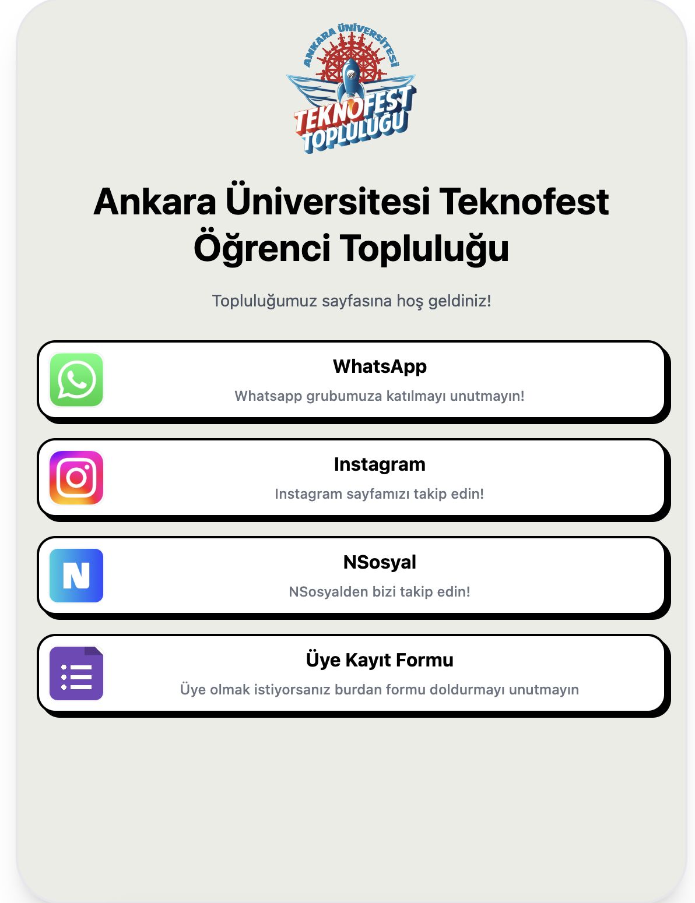

# 🚀 AUTF Links - Ankara University Teknofest Community

This project is a modern, fully customizable "Link-in-Bio" application developed for the **Ankara University Teknofest Community**.

Designed as an alternative to classic Linktree apps, it is built with **React** and **Tailwind CSS**, featuring a distinctive **Neubrutalism** design style.



## ✨ Features

- **Responsive Design:** Provides a full-screen native app feel on mobile devices.
- **Smart Desktop View:** Fixes width on desktop screens, transitioning to a stylish centered card layout.
- **Neubrutalism UI:** Modern aesthetic with bold borders, hard shadows, and vibrant colors.
- **Easy Management:** All content, links, and assets are managed via a single data file (`content.js`).
- **Orientation Lock:** Includes a warning overlay for landscape mode on mobile devices to ensure the best user experience.

## 🛠️ Tech Stack

This project is built using the following modern technologies:

- **[React](https://reactjs.org/)** (via Vite) - UI Library
- **[Tailwind CSS](https://tailwindcss.com/)** - Styling
- **JavaScript (ES6+)** - Logic

## 📂 Project Structure

A clean and modular file structure is used:

```bash
src/
├── components/      # UI Components (Header, LinkCard, etc.)
├── data/            # Content data (content.js)
├── App.jsx          # Main application layer
└── main.jsx         # Entry point

public/
└── logos/           # Social media icons and logos